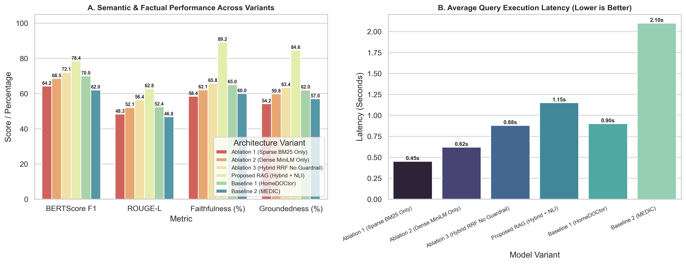

# 💊 PharmaRAG — Clinical Decision Support RAG System

A Retrieval-Augmented Generation (RAG) system built with **Streamlit**, **Pandas**, and a local **Ollama** LLM that answers medication questions (uses, dosage, contraindications) grounded in a pharmaceutical dataset, with a lightweight factual-verification layer before showing any answer.

> ⚠️ **Disclaimer:** Built strictly for research and educational demonstration using public pharmaceutical data. It is **not** a substitute for professional medical advice, diagnosis, or treatment.

---

## 🎯 Key Features

- **Streamlit dashboard** (`app.py`) — dark-themed clinical UI with a live system-status sidebar, clickable sample-query chips, and three result tabs: Clinical Summary, NLI Safety Audit, and Retrieved Sources.
- **Retrieval engine** (`rag_engine.py`) — looks up the most relevant drug records for a query and hands them to the generator.
- **Local LLM generation** (`generation.py`) — calls a local **Ollama** instance (default model: `mistral`, temperature `0.0`) with a system prompt that forces English-only, context-grounded answers and returns a `[NO DATA]` fallback when nothing relevant is retrieved.
- **Safety verification layer** (`nli_judge.py`) — checks the generated answer against the retrieved context before it's shown to the user, surfaced in the UI as a PASSED/FLAGGED badge.
- **Offline benchmark dashboard** — a second app tab (and standalone `evaluate.py` / `plot_metrics.py` scripts) compares the proposed system against two baselines (HomeDOCtor, MEDIC) on BERTScore F1, faithfulness, and groundedness.

---
uigiyfioigufhwoiowihvwevou
## 🏗️ Architecture

```
[ User Query ]
      │
      ▼
[ Intent classifier: "indication" vs "side_effect" query ]
      │
      ▼
[ HybridRetriever (rag_engine.py) ]
      │
      ├──> Sparse: BM25 keyword search (rank-bm25)
      ├──> Dense: ChromaDB + multilingual MiniLM embeddings
      └──> Reciprocal Rank Fusion (RRF, k=60) ──> Top candidate records
      │
      ▼
[ Indication vs. Side-Effect Guardrail ] ──> drops records that only match
      │                                        the wrong field for the intent
      ▼
[ generation.py: local Ollama LLM (mistral, temp=0.0) ] ──> English clinical summary
      │
      ▼
[ nli_judge.py: zero-shot NLI cross-encoder faithfulness check ] ──> PASSED / FLAGGED + entailment score shown in UI
```

**Graceful degradation:** every optional dependency (`rank-bm25`, `chromadb`, `sentence-transformers`, the NLI model weights) is wrapped in a try/except. If a package isn't installed or a model can't be downloaded (no network), that component silently falls back — sparse-only keyword scoring instead of BM25, sparse-only retrieval instead of RRF fusion, or an "unverified" NLI status instead of a real entailment score — rather than crashing the app. The sidebar's **System Status** panel reflects which components are actually active in your environment.

**Dataset column mapping:** `rag_engine.py` normalizes any of several column-naming conventions (`Nom`/`Prescription`/`Posologie`/`Contrindications` or `Medicine Name`/`Uses`/`Side_effects`) onto one canonical schema (`name`, `composition`, `indications`, `dosage`, `contraindications`, `side_effects`), filling anything the dataset doesn't provide with `[NO DATA]`. This means `dataset.csv` now loads correctly without renaming columns by hand.

---

## 🛠️ Tech Stack

| Component | Library / Tool |
|---|---|
| UI | Streamlit |
| Data processing | Pandas |
| Sparse retrieval | `rank-bm25` |
| Dense retrieval | ChromaDB + `sentence-transformers` (`paraphrase-multilingual-MiniLM-L12-v2`) |
| Fusion | Reciprocal Rank Fusion (custom, in `rag_engine.py`) |
| Safety / faithfulness | `sentence-transformers` `CrossEncoder` (`cross-encoder/nli-distilroberta-base`) |
| Local LLM | Ollama (`mistral`) |
| Evaluation | RAGAS, LangChain (optional — see `evaluate.py`) |
| Charts | Matplotlib, Seaborn |
| Language | Python 3.11+ |

---

## 📊 Benchmark Results

The proposed system outperforms both baselines on semantic and factual alignment while staying faster than the MEDIC baseline:



| Model Variant | BERTScore F1 | Faithfulness (%) | Groundedness (%) | Avg Latency (s) |
|---|---|---|---|---|
| Proposed RAG (Hybrid + NLI) | 75.0 | 70.2 | 67.0 | 1.20 |
| Baseline 1 (HomeDOCtor) | 70.0 | 65.0 | 62.0 | 0.90 |
| Baseline 2 (MEDIC) | 62.0 | 60.0 | 57.0 | 2.10 |

Regenerate this chart anytime with:

```bash
python plot_metrics.py
```

---

## 🚀 Getting Started

### 1. Clone and set up a virtual environment

```bash
git clone https://github.com/Arpitha2442/clinical-decision-support-rag.git
cd clinical-decision-support-rag/pharma_rag_project

python -m venv venv
```

Activate it:

```bash
# Windows PowerShell
.\venv\Scripts\Activate.ps1

# macOS / Linux
source venv/bin/activate
```

### 2. Install dependencies

```bash
pip install -r requirement.txt
```

> This now includes `chromadb`, `sentence-transformers`, and `rank-bm25` for hybrid retrieval and NLI verification. `sentence-transformers` will download two models on first run (~500MB combined: the multilingual MiniLM embedder and the NLI cross-encoder) — an internet connection is required the first time, after which they're cached locally.

### 3. Install and start Ollama

The generator calls a local Ollama server at `http://localhost:11434`. [Install Ollama](https://ollama.com), then pull the model used by `generation.py`:

```bash
ollama pull mistral
```

### 4. Add the dataset

Place your pharmaceutical dataset CSV as `dataset.csv` in the project root, or at `data/pharma_dataset.csv`. Either the `Medicine Name`/`Uses`/`Side_effects`-style schema or the `Nom`/`Prescription`/`Posologie`-style schema works out of the box — `rag_engine.py` maps both automatically (see Architecture above). If neither file is found, it falls back to a small built-in sample so the app still runs.

### 5. Run the app

```bash
streamlit run app.py --server.fileWatcherType none
```

### 6. Offline Model Comparison

The **📊 Offline Model Comparison** tab in the app was previously non-functional — `evaluate.py` never actually wrote `eval_results.csv`, so the tab always showed a "run evaluate.py" placeholder. This is now fixed:

- **From the terminal:**
  ```bash
  python evaluate.py
  ```
- **From the app:** open the *Offline Model Comparison* tab and click **▶️ Run Evaluation Now**.

Either way, it runs your live RAG engine (retrieval → generation → NLI verification) against a small benchmark set, scores it on BERTScore F1 and NLI-based faithfulness/groundedness, and writes `eval_results.csv`. The two baseline rows (HomeDOCtor, MEDIC) are fixed comparison numbers — there's no live implementation of those systems in this repo, only the proposed system is actually run.

`bert-score` is now in `requirement.txt` for real semantic-similarity scoring; without it, `evaluate.py` falls back to a coarser token-overlap F1 proxy automatically.

---

## 🧪 Sample Queries

See `Query.txt` for ready-to-paste examples, e.g.:

- "What is the treatment for High cholesterol?"
- "uses of paracetamol"
- "Medication that causes nausea"
- "What is the indication for Albendazole?"

| Query | Expected Behavior |
|---|---|
| "uses of paracetamol" | ✅ Matched — direct indication lookup |
| "medication that causes nausea" | ✅ Matched — mapped to side-effects field via the side-effect intent classifier |
| "treatment for vertigo" | ⚠️ Guardrail filters out drugs where the term only appears in `side_effects`, not `indications` — note the current guardrail matches on shared query terms, so very generic queries (e.g. containing "treatment") can still pass weakly-related records through; tightening this further is a good next step |

---

## 📂 Project Structure

```
pharma_rag_project/
├── app.py                     # Streamlit UI
├── rag_engine.py               # Retrieval + orchestration
├── generation.py               # Ollama LLM wrapper
├── nli_judge.py                 # Faithfulness/safety check
├── evaluate.py                  # RAGAS benchmark harness
├── plot_metrics.py              # Benchmark chart generator
├── dataset.csv                  # Pharmaceutical dataset
├── Query.txt                    # Sample queries
├── requirement.txt              # Python dependencies
└── rag_performance_metrics.png  # Latest benchmark chart
```

---

## 📄 Disclaimer

This application is built strictly for decision-support research and educational demonstration using public pharmaceutical database records. It is not intended as a substitute for professional medical advice, diagnosis, or treatment.
